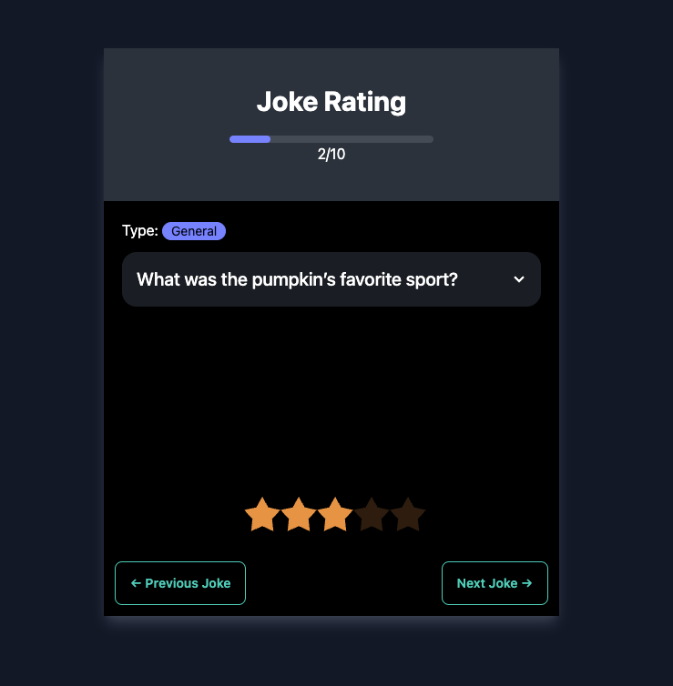

# Joke Rating APP

[JRA](https://joke-rating-app.netlify.app/): Vue.js app created from scratch through [Vite](https://vitejs.dev/) that consume [Joke API](https://github.com/15Dkatz/official_joke_api/).

## App Live Demo

[](https://app.netlify.com/sites/joke-rating-app/deploys)

👉 https://joke-rating-app.netlify.app/

---



## Project Setup

```sh
npm install
```

### Compile and Hot-Reload for Development

```sh
npm run dev
```

### Type-Check, Compile and Minify for Production

```sh
npm run build
```

### Lint with [ESLint](https://eslint.org/)

```sh
npm run lint
```
